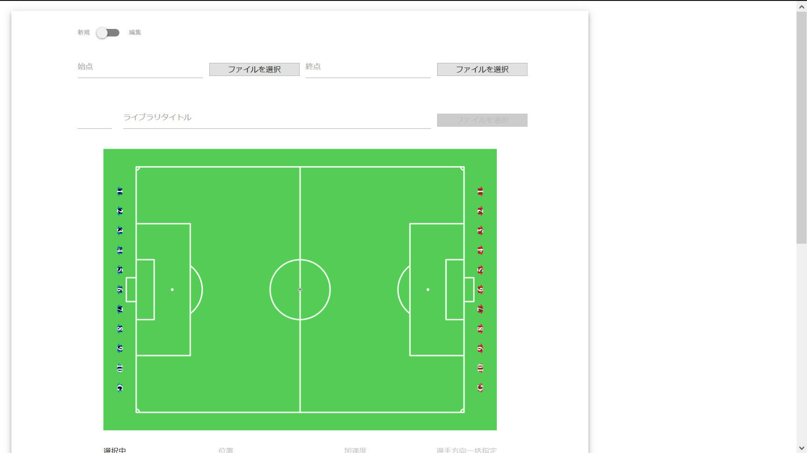

## 仕事内容の説明
### 概要・仕事の手順
株式会社LIGHTzから依頼された仕事内容は大きく3に別れます．

1. 選手の位置データ([.csv](http://www.pc-master.jp/sousa/csv.html))を作成

2. ログファイル([.log](http://wa3.i-3-i.info/word11953.html))の作成

3. 絵コンテ([.pptx](https://www.weblio.jp/content/.pptx))の作成

このうち，選手の位置データとログファイルはこれから説明するPoint Saverというツールを使用して作ります．

絵コンテはPoint Saverで画像を作ってから，パワーポイントで作ってもらいます．

### 選手の位置データ作成

##### 完成した絵コンテの例：

### ログファイル作成
[絵コンテ・Log]()を参考にして.logファイルを取得する．

ファイル名を**始点_終点_日付(201711XX)_人名_番号（自分がやった分数）_番号（コマに合わせて１～４のどれか）.log**に変更

##### 完成した絵コンテの例：

### 絵コンテ作成
[絵コンテ・Log]()を参考にして.pngファイルを取得します．

絵コンテテンプレ.pptxを開き，画像を張り付けてください．

テンプレの矢印と吹き出しを用いて，指定されたプレーの範囲でいいので説明を打ち込んでください．

                実践の矢印   →       選手の動き
                点線の矢印   →       ボールの動き
                
絵コンテが完成したら，4コマ分（1分）のスライドを
ファイル名を**始点_終点_日付(201711XX)_人名_番号（自分がやった分数）_番号（コマに合わせて１～４のどれか）.log**に変更

##### 完成した絵コンテの例：

## ツールの説明

### 推奨ブラウザ
FireFox

※ その他のブラウザでの動作は保証しかねます。

Point Saverはブラウザで起動するツールです．

FireFoxをダウンロードしていない場合はダウンロードする必要があります．

以下のリンクからダウンロードしてください．

URL: [新しいファイアフォックス](https://www.mozilla.org/ja/firefox/new/)

### ツールの起動
PointSaverフォルダー内のindex.htmlを右クリック．

プログラムから開くを押して，FireFoxを選択する．

### 起動画面の説明

画面を開くと上のような画面が出てくる可能性があります．

ページを縮小（Ctrlと-を同時に押す，もしくは設定などから）して，下の画面と同じような表示にすると使いやすいです．

#### 選手の配色 
青：味方

赤：敵

## 操作手順
### ライブラリデータを新規作成

1.　新規・編集の「新規」にチェックを入れてください。(デフォルトでは新規にチェックが入っています。)

2.　始点データと終点データを選択して確定してください。(データはdataフォルダ内にあります。)

3.　ライブラリのタイトルを入力してください。

4.　<データ作成>に進んでください。

        ※始点・終点データ（1コマ目・最終コマ）は他のライブラリと連動するための特別なデータです。

        ※始点データは変更できませんが、終点データは時間、選手回転方向、加速度のみ変更可能です。

        ※ファイル選択にて、本ツールで作成したものでないCSVファイルを読み込んだ場合の動作は保証しかねます。

### 既存のライブラリデータを編集

1.　新規・編集の「編集」にチェックを入れてください。(デフォルトでは新規にチェックが入っています。)

2.　<データ作成>に進んでください。

        ※ファイル選択にて、本ツールで作成したものでないCSVファイルを読み込んだ場合の動作は保証しかねます。

### データ作成

1.　編集コマの選択

        データの一覧より編集するコマを選択します。
        選択したコマ番号のデータが表示されます。

2.　選手・ボールの位置の決定

        選手・ボールをドラッグ＆ドロップして移動します。(選択して矢印ボタンでも移動できます。)

3.　選手の角度の決定　

        キーボードの[Ctrl]キーを押しながらマウスで選手をクリックすると、選手が時計回りに回転します。
        また、[Ctrl]+[Shift]キーを押しながらマウスで選手をクリックすると、選手が反時計回りに回転します。

4.　選手の回転方向の決定　

        選手を選択し、データ設定の「選手回転方向」を選択します。
        選手が前の位置から指定した位置に回転する時の方向を設定します。

5.　選手・ボールの加速度の設定

        選手 または ボールを選択し、データ設定の「加速度」を選択します。
        選手が前の位置から指定した位置に移動する時の加速度を設定します。
        加速度の動作イメージは、選択リストを表示した時にグラフで表示されます。

6.　「時間」の設定

        前の位置から指定した位置に移動する時間を秒単位で入力します。（0.1秒刻み、原則１秒）

7.　ボールホルダーの選択

        選手を選択し、「ボールホルダー選択(1名)」ボタンをクリックします。
        既に選択済みのときに別の選手に上記の処理を行うとボールホルダーが切り替わります。

8.　キープレイヤーの選択
 
        選手を選択し、「キープレイヤー選択(複数名可)」ボタンをクリックします。

9.　保存

        「保存して次へ」ボタンにて編集したデータの保存をします。
        設定したデータが保存され、次のコマ番号に切り替わります。

【すべての時間軸のデータの作成が終了するまで、1～9 を繰り返します。】

10.　ダウンロード

        「データをファイルで保存」ボタンをクリックすると、作成したデータをCSV形式で出力します。
        保存先は作業ユーザのダウンロードフォルダです。
        同じファイル名で生成した場合、別ファイルとして出力されます。
        ※ この処理を行わないと作成したデータがなくなりますので、必ず行ってください。

### その他機能

1.　編集コマの追加・削除
        「前に追加」、「後ろに追加」ボタンにて、編集コマの追加ができます。
        ※始点データの前、終点データの後には追加できません。

2.　編集コマの削除

        「削除」ボタンにて、編集コマの削除ができます。
        ※始点・終点データは削除できません。

3.　動作確認

        「確認画面を開く」ボタンをクリックすると、作成したデータをアニメーションで確認できます。

4.　自動保存

        「編集コマの選択」、「前に追加」、「後ろに追加」、「削除」、「確認画面を開く」、「絵コンテ参照・Log設定」、「データをファイルで保存」を行うと、データが自動で保存されます。

### 絵コンテ・Logの取得
1．「絵コンテ参照・Log設定」の下にあるボタンをクリックすると、絵コンテの画像とLogの入力欄のある子ウィンドウが表示されます。
ボタンが押せない場合は上記の<データ作成>を先に行ってください。

        ※各ボタン
        1：コマ番号「(始点)～15」のプレー1
        2：コマ番号「15～30」    のプレー2
        3：コマ番号「30～45」    のプレー3
        4：コマ番号「45～(終点)」のプレー4

2．Logの入力

        「プレー成立条件」の入力欄を増やす場合、[+]ボタンをクリックしてください。
        大項目（プレー種類・プレー意図など）を増やす場合、追加ボタンをクリックしてください。
        増やした入力欄を削除する場合、[-]ボタンをクリックしてください。

3．保存

        「画像・Logダウンロード」ボタンをクリックすると、作成した画像とLogを出力します。
        保存先は作業ユーザのダウンロードフォルダです。
        同じファイル名で生成した場合、別ファイルとして出力されます。
        ※ この処理を行わないと作成したデータがなくなりますので、必ず行ってください。

### csvデータ形式
        コマ番号,時間,味方1x,味方1y,...,味方2x,味方2y,...,味方11x,味方11y,...,敵1x,敵1y,...敵11x,敵11y,敵11角度,敵11イベント,敵11加速度
        コマ番号,時間,味方1x,味方1y,...,味方2x,味方2y,...,味方11x,味方11y,...,敵1x,敵1y,...敵11x,敵11y,敵11角度,敵11イベント,敵11加速度
        コマ番号,時間,味方1x,味方1y,...,味方2x,味方2y,...,味方11x,味方11y,...,敵1x,敵1y,...敵11x,敵11y,敵11角度,敵11イベント,敵11加速度

